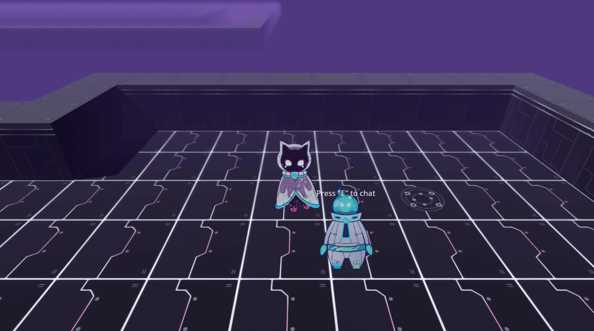
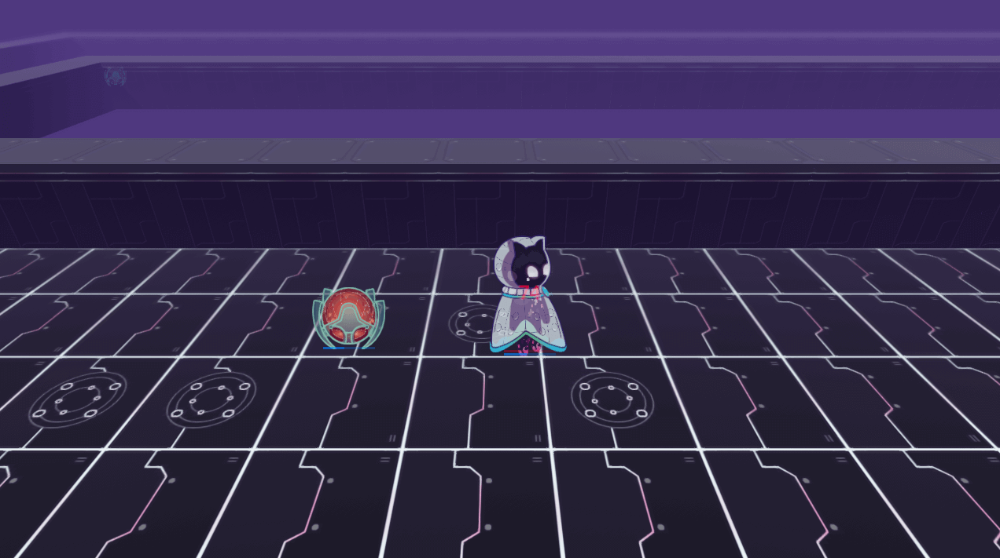
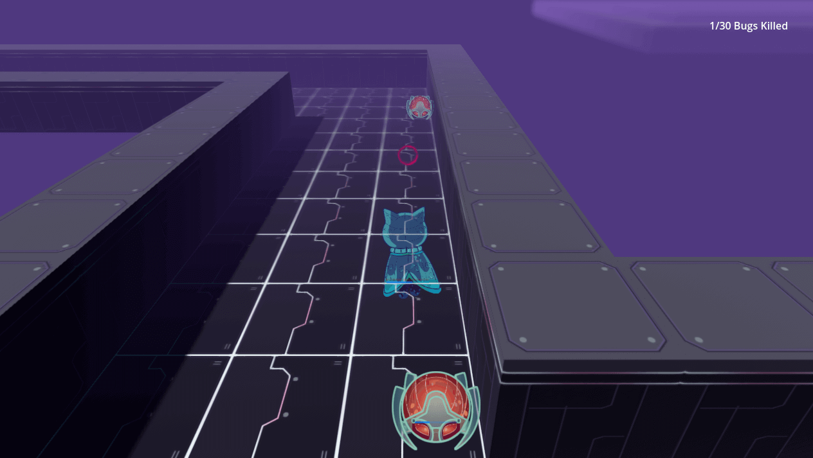

# "It's not a Bug, it's a Feature?"

["It's not a Bug, it's a Feature?"](https://partyvaper.itch.io/its-not-a-bug-its-a-feature) is a game jam [entry](https://itch.io/jam/game-off-2022/rate/1778937) for the [GitHub Game Off 2022 Game Jam](https://itch.io/jam/game-off-2022).

Game is made using [Godot 4 Beta ~7](https://github.com/godotengine/godot). (Yes, a beta!) (Please note web performance might be poor, download binaries instead!)

Some of my [other games](https://partyvaper.itch.io) that are mostly made using Godot 3.

## Controls

**AWSD** - Move

**Q** - Shoot

**E** - Talk

**R** - Shoot

## Screenshots

## Misc

There were other things planned for the story, another different environment, a plot twist, a bug NPC quest, but due to time limitations nothing got added.

About the secret part - browser the source code! ;)

## Authors

Code - [partyvaper](https://github.com/partyvaper)

Assets - [paranoya](https://www.twitch.tv/paranoyay)

Audio - [kenney.nl](https://kenney.nl)

Audio - [ObservingTheStar](https://opengameart.org/content/another-space-background-track)

If any other assets made the release and I didn't notice, please let me know, I'll add authors here!
